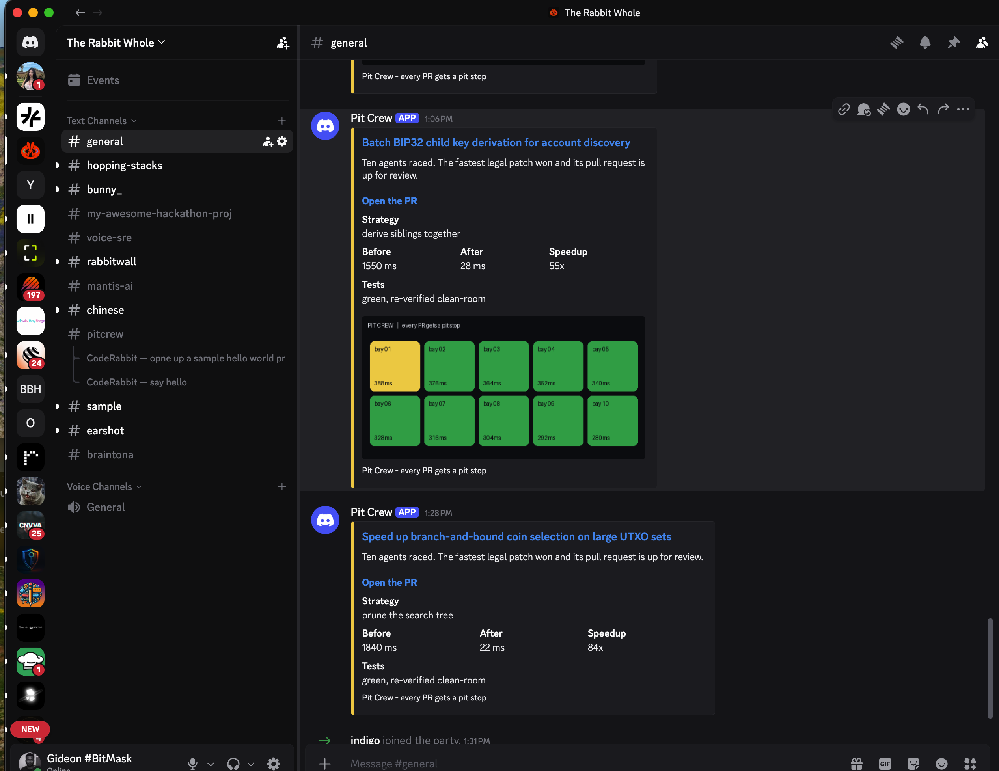

# Pit Crew

**Every PR gets a pit stop.** Ten AI agents race in parallel isolated sandboxes to
make a pull request's code faster; the tests decide who is legal, the fastest patch
wins, a human approves, and it opens a reviewed PR. Built for **bitmask-core**, an
open-source Bitcoin wallet, for the **Daytona HackSprint (Friday, July 24 2026)**.

This folder is the whole project: working engine, decks, and every planning doc.

## How it works

```
   ┌────────────────────────────────────────────────────────────────┐
   │   PIT CREW  ·  every PR gets a pit stop                         │
   └────────────────────────────────────────────────────────────────┘

   [1]  open the app                ──►  Next.js console, hosted on Vercel
          │
          ▼
   [2]  race runs                   ──►  Daytona     10 sealed sandboxes
          │  10 agents, one patch        Fireworks   writes every patch
          │  each · tests gate + bench
          ▼
   [3]  winner shown                ──►  Braintrust  scores & ranks each bay
          │  fastest legal: 619ms → 9ms
          ▼
   [4]  "approve the winner"        ──►  CopilotKit  turns words into the action
          │  typed or spoken             ElevenLabs  voice in / voice out
          ▼
   [5]  PR posts to Discord         ──►  webhook + race GIF, real PR link
          │
          ▼
   [6]  CodeRabbit reviews the PR   ──►  CodeRabbit  review lands in the channel
```

Six sponsor tools, one loop: a slow PR comes in, ten agents race to fix it, the
fastest legal patch wins, a human approves by voice or text, and the winning PR
goes out for an automated review.

### The winning PR lands in Discord, and CodeRabbit reviews it



Each race posts a distinct PR with its own strategy, before/after, and race GIF.
CodeRabbit picks it up in the channel and reviews it, closing the loop.

## Inspiration

I am the founder of an open-source Bitcoin wallet backed by Tim Draper, with over 300,000 wallets created. Every pull request that lands in that codebase has to be fast and safe, because real people are moving real money through it.

Take UTXO coin selection. When you send Bitcoin, the wallet has to pick which unspent outputs to spend. That is a combinatorial search, and it sits on the hot path of every single transaction. The set of outputs only grows, and the number of ways to combine them explodes, so a slow implementation is a wallet that feels broken, and a subtly wrong one loses money. Reviewing that kind of PR by hand, and actually proving one version is faster than another without breaking it, takes real time a small team does not always have.

PitCrew is the pit stop every PR deserves. It does this for our wallet, and it can do it for any team. It can even take a legacy codebase and start making it agentic, one function at a time.

## What it does

A pull request comes in with a slow function. PitCrew races ten AI agents to fix it, and only lets a winner out if it is both correct and fast.

- Ten agents spin up, each in its own sealed cloud machine, each seeded with a different optimization strategy, each writing its own candidate patch.
- The test suite is the referee. A patch that is faster but wrong gets disqualified. A patch that is correct but slow gets retired. Only a patch that is both survives.
- The fastest legal patch wins, and PitCrew re-runs it in a clean machine that never saw the race, so the number is honest.
- You approve the winner by voice or by typing. The winning PR posts to your team Discord with a replay of the race, and CodeRabbit reviews it automatically.

Concrete example: a contributor speeds up coin selection over a large UTXO set. PitCrew proves the new version is dramatically faster with byte-identical output, then opens the reviewed PR. Nobody benchmarked anything by hand.

## How we built it

Six sponsor tools, one loop.

- **Daytona** runs the ten agents, each in an isolated sandbox. Untrusted AI code runs at full speed with zero blast radius, and that same isolation is what makes the benchmark trustworthy.
- **Fireworks** writes the ten patches, one per agent, each with a different strategy seed. It also powers the assistant you talk to, so the whole product leans on one inference provider instead of bolting on another.
- **Braintrust** scores and ranks every agent, so the race is a measured tournament with data behind it, not a lottery.
- **CopilotKit** turns "approve the winner" or "kill everything slower than 100ms" into a real action on the grid. The model only pulls the number out of your sentence. The actual work is plain code, which is exactly why typing is a perfect fallback if the mic dies.
- **ElevenLabs** gives the crew a voice, hearing the command and answering back over pit radio.
- **CodeRabbit** reviews the winning PR the moment it lands in Discord.

The console itself is a Next.js app on Vercel that runs the race client-side, so the public demo needs no backend on anyone's laptop.

## Challenges we ran into

Almost every problem was a "looks fine, is quietly broken" problem. We are proud of catching them early.

- **We planned for thirty agents.** We measured, and the account tops out at ten concurrent sandboxes because of a CPU quota. We found that the night before instead of on stage, so the whole demo now says ten and means it.
- **A dependency deadlock.** One SDK required an older pydantic, another required a newer one, and no single version satisfied both. We pinned the combination that actually works and wrote down why, so nobody "fixes" it back into a break under pressure.
- **The recommended model did not exist.** The docs pointed at a model our account could not see. Auth passed, the model 404'd. We probed the live model list, tested candidates on the real patch task, and picked the fastest one.
- **GitHub threw 500s while opening the winning PR.** Right as we shipped, GitHub's pull-request API had an incident. We built retry-through-5xx, and it rode straight through.
- **Small landmines everywhere.** An SDK class the docs referenced but did not exist. An API key minted with zero permissions. Clients constructed at build time with no keys. A font that fetched at build and would have died on venue wifi. Each one would have been a live-demo failure. Each one got caught first.

## Accomplishments that we're proud of

- **It works end to end, for real.** A real PR, a real race, a real winning patch that is many times faster with identical output, a real Discord post, and a real CodeRabbit review. Nothing staged.
- **We never fake a result.** Every number the demo shows is measured, and every link points at a real record. When a review is real, we show it. When it is not, we do not pretend it is.
- **Honest tradeoff by design.** The target function is correct but slow on purpose, so the race has a real finish line the tests enforce, not a scripted outcome.
- **One URL is the whole product.** A single Vercel deploy runs the race, the voice, the Discord post, and the review handoff. No laptop in the loop.

## What we learned

- **The demo that survives a stage is the one you already broke in private.** We ran the whole loop many times. It broke, we fixed it, we ran it again. Simple as that.
- **Isolation is a measurement feature, not just a safety one.** You cannot trust a benchmark that shares a machine, so the sandbox that keeps untrusted patches safe is the same thing that makes the timing honest.
- **Give the LLM the smallest possible job.** Ours only extracts a number. Everything downstream is deterministic, and that is what makes it reliable enough to run live in front of judges.

## What's next for PitCrew

- **A security lane.** Same race, but the referee is a fuzzer and a static analyzer instead of a benchmark. Every PR to a wallet should be proven safe, not just fast.
- **A real tournament.** Turn the single race into rounds: keep the fastest legal patches, mutate them, and race again.
- **Language-agnostic bays.** The engine already treats a bay as "run a command, read a result." Rust, Go, and TypeScript targets are a small step, which matters because our own wallet is mostly Rust.
- **Legacy to agentic.** Point PitCrew at an old codebase and let it optimize and harden it function by function, opening reviewed PRs the whole way.

## Run it now (no keys)

```bash
pip install -r pitcrew-requirements.txt   # or just: pip install pytest
python3 -m pytest pitcrew/tests widget-api/tests -q   # 13 tests
python3 -m pitcrew.cli          # full 10-bay race in the terminal
python3 -m pitcrew.serve        # then open http://localhost:8420  (live UI)
python3 -m pitcrew.evals        # Braintrust-style strategy leaderboard
python3 hello.py                # stack check (skips services with no key)
```

Everything runs in **mock mode** with no API keys: the LLM and cloud sandbox are
stubbed, but the tests, timing, guard, ranking, and clean-room verify are all real.

## Where everything is

| Path | What it is |
|---|---|
| `pitcrew/` | the race engine (mock + Friday-swap adapters). See `pitcrew/README.md` |
| `widget-api/` | the target repo Pit Crew races against. See `widget-api/DEMO.md` |
| `ui/index.html` | the console design reference (animated fake race) |
| `ui/live.html` | the console wired to the live engine over SSE |
| `copilotkit/` | the Next.js voice + action files. See `copilotkit/README.md` |
| `deck-mvp/` | **the deck to present** (13 slides) |
| `deck-pitcrew/`, `deck/` | full-vision deck and an alternative cut |

## The docs, in reading order

| Doc | Purpose |
|---|---|
| `PITCH.md` | the 3-minute live pitch script (solo, in the jersey) |
| `SUBMISSION.md` | the Devpost submission text, ready to paste |
| `VIDEO.md` | the under-2-minute demo video script |
| `MVP.md` | the hour-by-hour Friday build schedule and cut list |
| `BUILD.md` | repo layout, the bay contract, the demo-repo code |
| `SETUP.md` | per-tool setup, keys, and sponsor priority order |
| `INSTALL.md` | everything to install on a bare Mac |
| `PRODUCT.md` | the full product/feature spec |
| `.env.example` | the keys needed for the live services |
